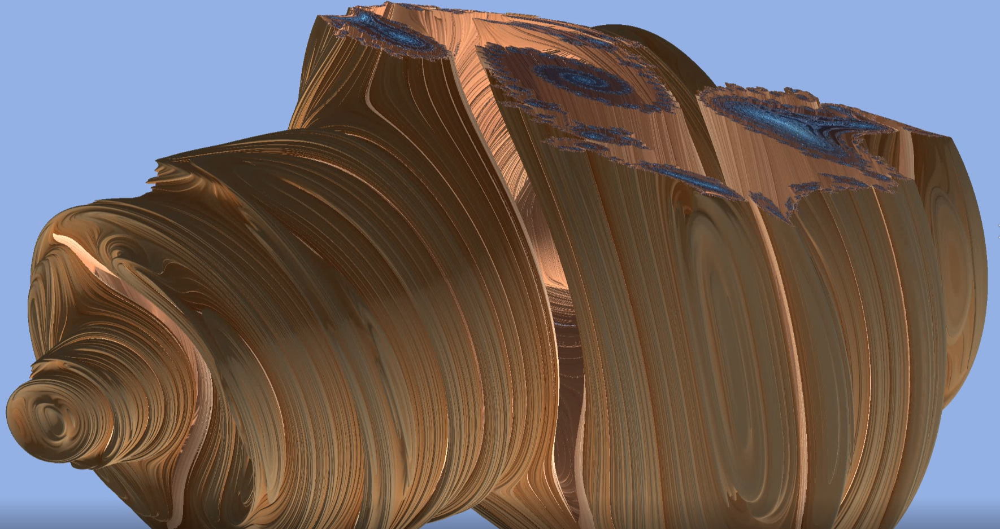
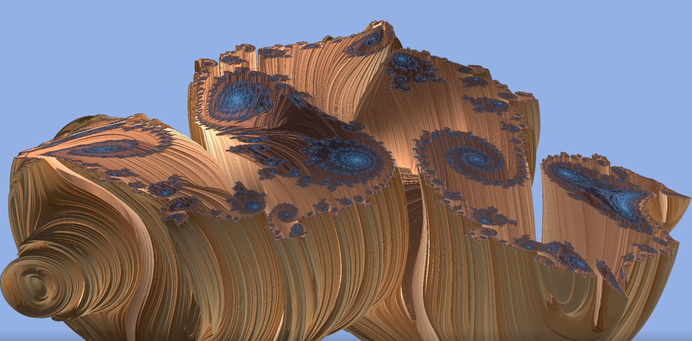
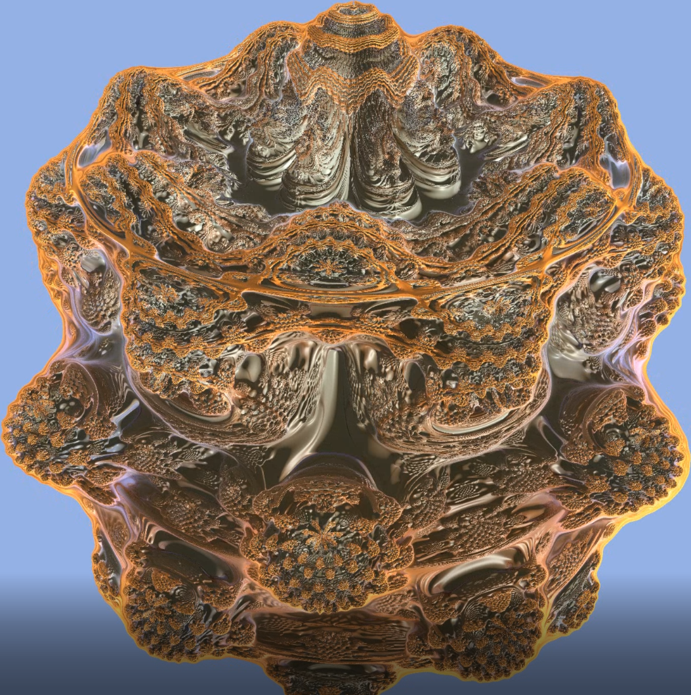
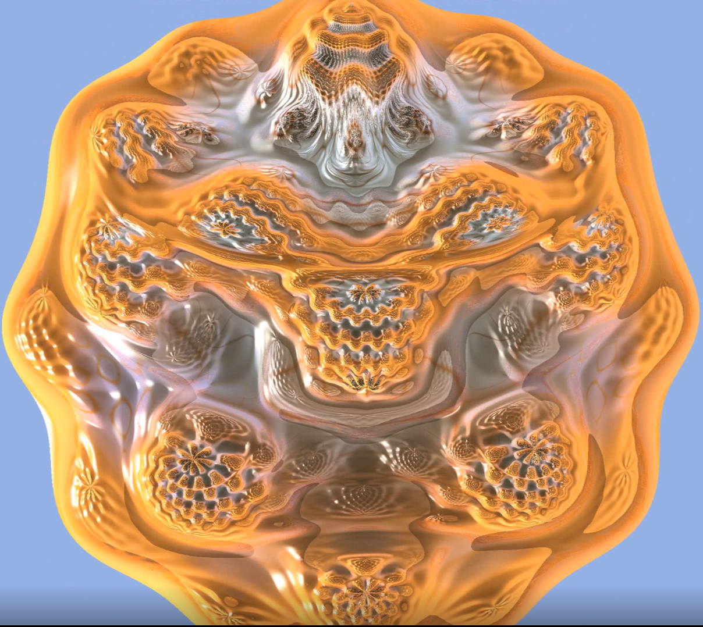
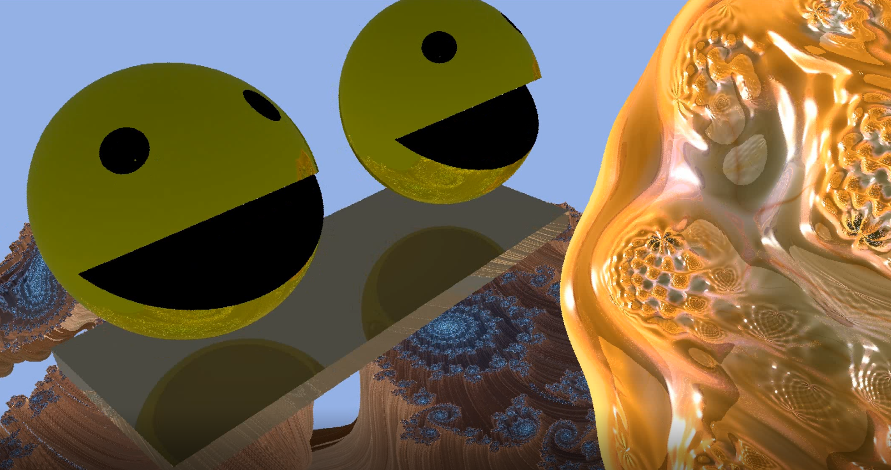

# Proceduray

Proceduray is an engine for real-time ray tracing of procedural geometry. Its motivation is the current lack of mid-level abstraction tools for scenes with primitives involving intersection shaders. Those scenes impose strict engine design choices, since they need flexibility in the shader table setup. Proceduray aims to provide a fair tradeoff between that flexibility and productivity. It also aims to be didactic. Shader table behaviour can be very confusing because parameters for indexing it come from different parts of a system, involving both host and device code. This is different in essence than ray tracing triangle meshes (which uses a builtin intersection shader for all objects) or rendering with the traditional graphics or compute pipelines.

In summary, Proceduray has the following properties:

* Shader table creation flexibility at a reasonable abstraction level.
* Didactic approach, including an acompaining technical report.
* A sample scene with several procedural objects, such as fractals and CSG objects. This includes the implementation of the chapter Real-time Rendering of Complex Fractals, from [Ray Tracing Gems 2](https://developer.nvidia.com/blog/ray-tracing-gems-ii-available-august-4th/).

## Teasers







## Requirements

Proceduray is an abstraction layer above the procedural geometry sample in the [DirectX 12 Graphics Samples](https://github.com/microsoft/DirectX-Graphics-Samples). As such it has the same requirements.

* Windows 10 with the May 2019 Update or later
* [Visual Studio 2019](https://www.visualstudio.com/) with the [Windows 10 May 2019 Update SDK (18362)] or later (https://developer.microsoft.com/en-US/windows/downloads/windows-10-sdk)

## Setup

Given that requirements are met, just clone the repository, open the Visual Studio 2019 solution in `Proceduray\src` and compile it.

## Acompaining Technical Report

The technical report [Proceduray -- A light-weight engine for procedural primitive ray tracing](https://arxiv.org/abs/2012.10357) contains a didactic approach to explain the engine and the design choices behind it. It is self contained and novice-friendly, starting from the ground-up with a discussion about basic DirectX 12 concepts, and building up the abstractions needed based on them.

## Sample

The `Proceduray\src` directory contains the main Visual Studio 2019 solution. The project `Proceduray` contains a sample with several procedural objects, including the full implementation (host and device code) of the chapter Real-time Rendering of Complex Fractals, from [Ray Tracing Gems 2](https://developer.nvidia.com/blog/ray-tracing-gems-ii-available-august-4th/).

## Citing

If Proceduray helps your research project, please cite it:

```
@article{dasilva2020proceduray,
  title={Proceduray--A light-weight engine for procedural primitive ray tracing},
  author={da Silva, Vin{\'\i}cius and Novello, Tiago and Lopes, H{\'e}lio and Velho, Luiz},
  journal={arXiv preprint arXiv:2012.10357},
  year={2020}
}
```

## Related links
* [Ray-VR](https://www.visgraf.impa.br/ray-vr/)
* [Ray Tracing Gems 2](https://developer.nvidia.com/blog/ray-tracing-gems-ii-available-august-4th/)
* [DXR Specs](https://microsoft.github.io/DirectX-Specs/d3d/Raytracing.html)

## Contributing

Since we have other research projects going, we will not be able to implement new features in Proceduray as fast as we would like. However, we welcome all help at fixing bugs and supporting new features or samples.  We'll be happy to take a look at pull requests.